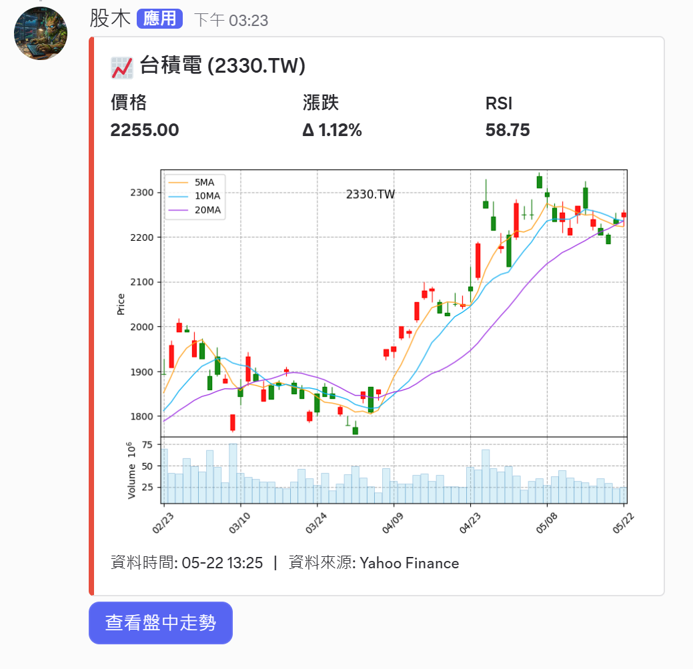
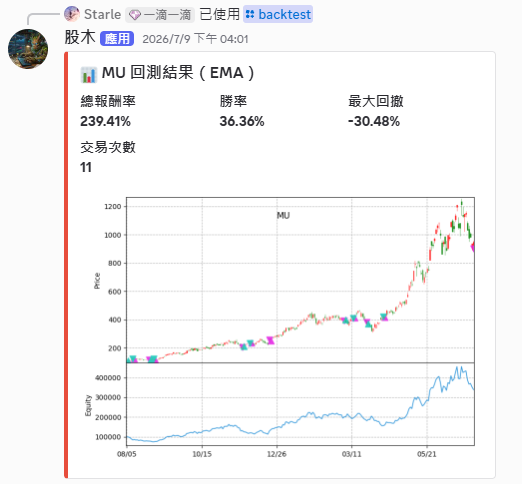

# Stock Bot


量化交易回測框架，用於驗證股票交易策略。支援**雙向交易**（做多／做空）、**自訂策略**、**止損機制**與績效指標（報酬率、勝率、最大回撤）。

核心特性：
- **累積倍率資產追蹤**：避免複利誤差，精確模擬資金曲線
- **策略與引擎解耦**：新增策略無需改動回測邏輯
- **完整交易紀錄**：每筆交易的進出場、價格、訊號條件與損益
- **Discord 機器人**：可直接於 Discord 中執行指令並輸出 Embed

<div>
  
  [](https://discord.com/oauth2/authorize?client_id=1494994206425612399)
  
  
  
</div>

---

## 技術架構

```
stock-bot/
├── src/
│   ├── bot/          # Discord 斜線指令 & UI 元件
│   ├── data/         # 股票資料查詢與下載
│   ├── quant/        # 技術指標計算 & 回測引擎
│   ├── database/     # 資料庫初始化與 CRUD
│   ├── models/       # 共用資料類別
│   └── utils/        # 圖表生成
├── scripts/
│   ├── seed_stocks.py           # 匯入台美股與全球指數基本清單
│   ├── historical_backfill.py   # 回補歷史 K 線至資料庫
│   └── daily_updater.py         # 更新每日數據至資料庫
└── main.py           # 啟動入口
```

各模組職責請見 [docs/ARCHITECTURE.md](./docs/ARCHITECTURE.md)，完整類別關聯與方法簽章請見 [docs/UML.md](./docs/UML.md)

---

## 資料庫結構

```sql
-- 股票基本資料
stocks (
    ticker  TEXT PRIMARY KEY,
    name    TEXT,
    market  TEXT
)

-- 歷史日線（OHLCV）
daily_prices (
    id                  INTEGER PRIMARY KEY,
    ticker              TEXT REFERENCES stocks(ticker),
    date                TEXT,
    open_price          REAL,
    high_price          REAL,
    low_price           REAL,
    close_price         REAL,
    adjust_close_price  REAL,  -- 除權息調整後收盤價
    volume              REAL,
    UNIQUE(ticker, date)
)
```

> **除權息調整**：查詢歷史資料時，系統以 `AdjClose / Close` 的比率回推開高低價，消除配息或股票分割造成的圖表跳空缺口。

---

## 快速開始

### 環境需求

- Python 3.13+
- [uv](https://docs.astral.sh/uv/) 套件管理器

### 安裝

```bash
# 安裝依賴
uv sync

# 建立 .env（參考下方欄位說明）
cp .env.example .env
```

`.env` 變數欄位：

| 變數 | 說明 |
|------|------|
| `DISCORD_TOKEN` | Discord Bot Token（從 [Discord Developer Portal](https://discord.com/developers/applications) 取得） |
| `GUILD` | （選填）測試伺服器 ID，設定後斜線指令立即生效，省去全域同步的 1 小時等待 |

### 初始化資料庫

```bash
python scripts/seed_stocks.py          # 寫入股票基本清單
python scripts/historical_backfill.py  # 回補歷史 K 線（需一段時間）
```

### 每日更新資料庫（建議使用工具排程）

```bash
python scripts/daily_updater.py
```

### 執行

```bash
python src/bot/dc_bot.py         # 啟動 Discord 機器人
python src/quant/backtest.py     # 執行回測（互動式）
python src/database/database.py  # 操作資料庫（互動式）
```

---

## Discord 指令說明

| 指令 | 說明 |
|------|------|
| `/stock <ticker>` | 查詢股票資訊、技術指標與 K 線圖 |
| `/backtest <ticker> <strategy> <period>` | 對指定股票執行策略回測，回傳績效指標與圖表（K 線 + 進出場標記 + 權益曲線） |

輸入格式範例：

| 輸入 | 自動解析為 | 說明 |
|------|-----------|------|
| `2330` | `2330.TW` | 台積電（台股上市） |
| `6488` | `6488.TWO` | 環球晶（台股上櫃） |
| `AAPL` | `AAPL` | 蘋果（美股） |
| `BRK.B` | `BRK-B` | 波克夏 B 股（Yahoo Finance 格式轉換） |
| `^GSPC` | `^GSPC` | S&P 500 指數 |

> 各指令的內部資料流與模組職責請見 [docs/ARCHITECTURE.md](./docs/ARCHITECTURE.md)

---

## 支援市場

### 台灣股票

- **上市（TSE）**：輸入純代碼，自動補齊 `.TW`
- **上櫃（TPEX）**：輸入純代碼，自動補齊 `.TWO`

### 美國股票

- 直接輸入代碼（`AAPL`、`TSLA`、`NVDA` 等）
- 含小數點代碼（如 `BRK.B`）自動轉換為 Yahoo Finance 格式 `BRK-B`

### 全球主要指數

| 代碼 | 指數 |
|------|------|
| `^GSPC` | S&P 500 |
| `^DJI` | 道瓊工業 |
| `^IXIC` | 那斯達克 |
| `^SOX` | 費城半導體 |
| `^TWII` | 台灣加權 |
| `^HSI` | 恆生 |
| `^N225` | 日經 225 |
| `000001.SS` | 上證綜合 |
| `^VIX` | 恐慌指數 |