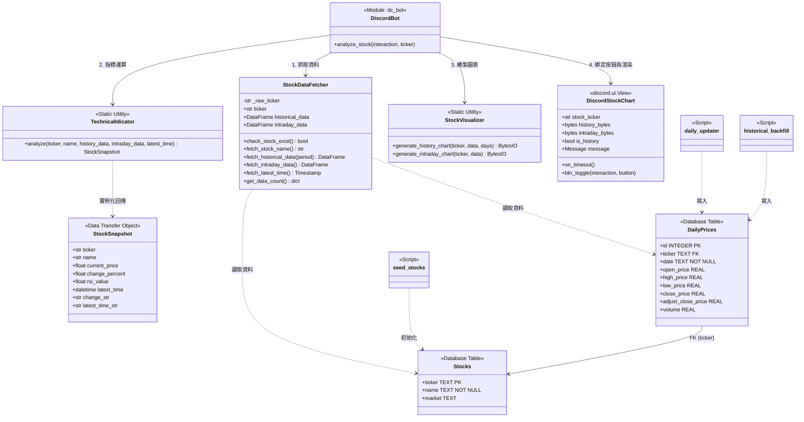

# 系統架構與 UML 類別圖

本圖表展示了此專案中各個模組之間的相依性與核心類別結構。

```mermaid
classDiagram
    direction TB

    %% --------------------------------
    %% 資料載體 (Models)
    %% --------------------------------
    class StockSnapshot {
        <<Data Transfer Object>>
        +str ticker
        +str name
        +float current_price
        +float change_percent
        +float rsi_value
        +datetime latest_time
        +str change_str
        +str latest_time_str
    }

    %% --------------------------------
    %% 資料擷取 (Data)
    %% --------------------------------
    class StockDataFetcher {
        -str _raw_ticker
        +str ticker
        +DataFrame historical_data
        +DataFrame intraday_data
        +check_stock_exist() bool
        +fetch_stock_name() str
        +fetch_historical_data(period) DataFrame
        +fetch_intraday_data() DataFrame
        +fetch_latest_time() Timestamp
        +get_data_count() dict
    }

    %% --------------------------------
    %% 技術分析 (Quant)
    %% --------------------------------
    class TechnicalIdicator {
        <<Static Utility>>
        +analyze(ticker, name, history_data, intraday_data, latest_time) StockSnapshot
    }

    %% --------------------------------
    %% 視覺化渲染 (Utils)
    %% --------------------------------
    class StockVisualizer {
        <<Static Utility>>
        +generate_history_chart(ticker, data, days) BytesIO
        +generate_intraday_chart(ticker, data) BytesIO
    }

    %% --------------------------------
    %% Discord 機器人與 UI (Bot)
    %% --------------------------------
    class DiscordStockChart {
        <<discord.ui.View>>
        +str stock_ticker
        +bytes history_bytes
        +bytes intraday_bytes
        +bool is_history
        +Message message
        +on_timeout()
        +btn_toggle(interaction, button)
    }

    class DiscordBot {
        <<Module: dc_bot>>
        +analyze_stock(interaction, ticker)
    }

    %% --------------------------------
    %% 資料庫表 (Database Tables)
    %% --------------------------------
    class Stocks {
        <<Database Table>>
        +ticker TEXT PK
        +name TEXT NOT NULL
        +market TEXT
    }

    class DailyPrices {
        <<Database Table>>
        +id INTEGER PK
        +ticker TEXT FK
        +date TEXT NOT NULL
        +open_price REAL
        +high_price REAL
        +low_price REAL
        +close_price REAL
        +adjust_close_price REAL
        +volume REAL
    }

    %% --------------------------------
    %% 獨立排程腳本 (Scripts)
    %% --------------------------------
    class daily_updater {
        <<Script>>
    }

    class historical_backfill {
        <<Script>>
    }

    class seed_stocks {
        <<Script>>
    }

    %% 關聯性定義 (Relationships)
    DiscordBot --> StockDataFetcher : 1. 抓取資料
    DiscordBot --> TechnicalIdicator : 2. 指標運算
    DiscordBot --> StockVisualizer : 3. 繪製圖表
    DiscordBot --> DiscordStockChart : 4. 綁定按鈕與渲染
    
    TechnicalIdicator ..> StockSnapshot : 實例化回傳
    
    StockDataFetcher ..> Stocks : 讀取資料
    StockDataFetcher ..> DailyPrices : 讀取資料
    daily_updater ..> DailyPrices : 寫入
    historical_backfill ..> DailyPrices : 寫入
    seed_stocks ..> Stocks : 初始化
    
    DailyPrices --> Stocks : FK (ticker)
```