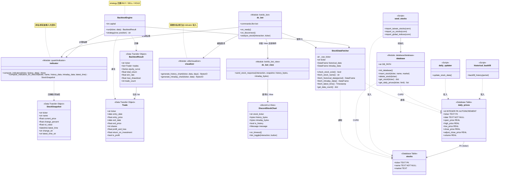

# 系統架構與 UML 類別圖

本圖表展示了此專案中各個模組之間的相依性與核心類別結構。

```mermaid
classDiagram
    direction TB

    %% --------------------------------
    %% 資料載體 (Models)
    %% --------------------------------
    class StockSnapshot {
        <<Data Transfer Object>>
        +str ticker
        +str name
        +float current_price
        +float change_percent
        +float rsi_value
        +datetime latest_time
        +str change_str
        +str latest_time_str
    }

    class Trade {
        <<Data Transfer Object>>
        +str ticker
        +date entry_date
        +float entry_price
        +date exit_date
        +float exit_price
        +int shares
        +float profit_and_loss
        +float return_on_investment
        +bool is_profit
    }

    class BacktestResult {
        <<Data Transfer Object>>
        +str ticker
        +list~Trade~ trades
        +Series equity_curve
        +float total_return
        +float win_rate
        +float max_drawdown
        +int trade_count
    }

    %% --------------------------------
    %% 資料擷取 (Data)
    %% --------------------------------
    class StockDataFetcher {
        -str _raw_ticker
        +str ticker
        +DataFrame historical_data
        +DataFrame intraday_data
        +check_stock_exist() bool
        +fetch_stock_name() str
        +fetch_historical_data(period) DataFrame
        +fetch_intraday_data() DataFrame
        +fetch_latest_time() Timestamp
        +get_data_count() dict
    }

    %% --------------------------------
    %% 技術分析 (Quant)
    %% --------------------------------
    class indicator {
        <<Module: quant/indicator>>
        +compute_indicators(ticker, history_data) None
        +compute_indicators_for_discord(ticker, name, history_data, intraday_data, latest_time) StockSnapshot
    }
    note for indicator "將指標寫進傳入的資料"

    class BacktestEngine {
        +int capital
        +run(ticker, data) BacktestResult
        +strategy(row, position) str
    }
    note for BacktestEngine "strategy 回傳 BUY / SELL / HOLD"

    %% --------------------------------
    %% 視覺化渲染 (Utils)
    %% --------------------------------
    class visualizer {
        <<Module: utils/visualizer>>
        +generate_history_chart(ticker, data, days) BytesIO
        +generate_intraday_chart(ticker, data) BytesIO
    }
    note for visualizer "需要的指標已由 indicator 寫入"

    %% --------------------------------
    %% Discord 機器人與 UI (Bot)
    %% --------------------------------
    class DiscordStockChart {
        <<discord.ui.View>>
        +str stock_ticker
        +bytes history_bytes
        +bytes intraday_bytes
        +bool is_history
        +Message message
        +on_timeout()
        +btn_toggle(interaction, button)
    }

    class dc_bot {
        <<Module: bot/dc_bot>>
        +commands.Bot bot
        +on_ready()
        +on_disconnect()
        +analyze_stock(interaction, ticker)
    }

    class dc_bot_view {
        <<Module: bot/dc_bot_view>>
        +send_stock_response(interaction, snapshot, history_bytes, intraday_bytes)
    }

    %% --------------------------------
    %% 資料庫操作 (Database)
    %% --------------------------------
    class database {
        <<Module: database/database>>
        +str DB_PATH
        +init_database()
        +insert_stock(ticker, name, market)
        +delete_stock(ticker)
        +get_stock(ticker) dict
        +get_daily_prices(ticker, limit) list
    }

    %% --------------------------------
    %% 資料庫表 (Database Tables)
    %% --------------------------------
    class stocks {
        <<Database Table>>
        +ticker TEXT PK
        +name TEXT NOT NULL
        +market TEXT
    }

    class daily_prices {
        <<Database Table>>
        +id INTEGER PK AUTOINCREMENT
        +ticker TEXT FK
        +date TEXT NOT NULL
        +open_price REAL
        +high_price REAL
        +low_price REAL
        +close_price REAL
        +adjust_close_price REAL
        +volume REAL
    }

    %% --------------------------------
    %% 獨立排程腳本 (Scripts)
    %% --------------------------------
    class daily_updater {
        <<Script>>
        +update_stock_data()
    }

    class historical_backfill {
        <<Script>>
        +backfill_history(period)
    }

    class seed_stocks {
        <<Script>>
        +import_taiwan_stocks(conn)
        +import_us_stocks(conn)
        +import_global_indices(conn)
    }

    %% 關聯性定義 (Relationships)
    dc_bot --> StockDataFetcher : 實例化
    dc_bot --> indicator : 計算指標
    dc_bot --> visualizer : 繪製圖表
    dc_bot --> dc_bot_view : 封裝 View 訊息物件
    dc_bot_view --> DiscordStockChart : 實例化 View

    indicator ..> StockSnapshot : 回傳股票快照

    StockDataFetcher ..> stocks : 讀取
    StockDataFetcher ..> daily_prices : 讀取

    database ..> stocks : CURD
    database ..> daily_prices : CURD

    daily_updater ..> daily_prices : 寫入
    historical_backfill ..> daily_prices : 寫入
    seed_stocks --> database : 初始化
    seed_stocks ..> stocks : 寫入

    daily_prices --> stocks : FK (ticker)

    BacktestEngine --> indicator : 計算指標
    BacktestEngine --> StockDataFetcher : 取得歷史資料
    BacktestEngine ..> Trade : 產生
    BacktestEngine ..> BacktestResult : 回傳
    BacktestResult --> Trade : 包含 list
```