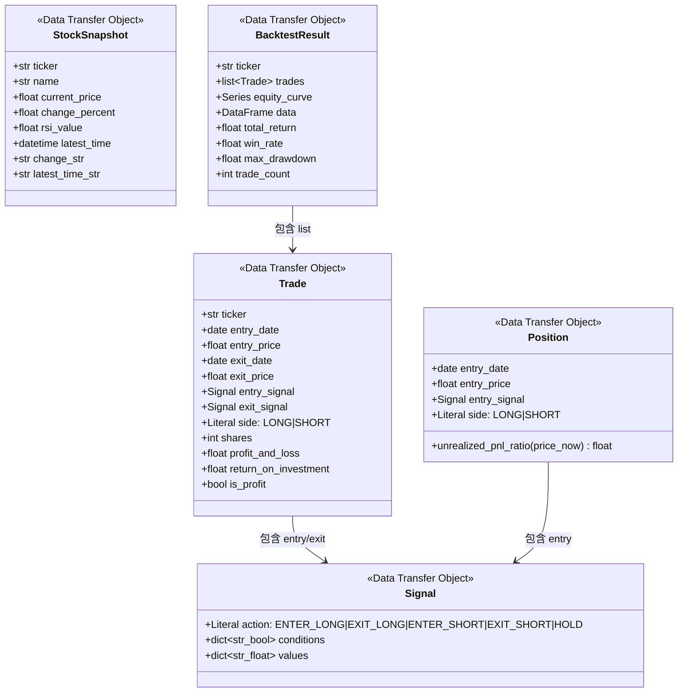
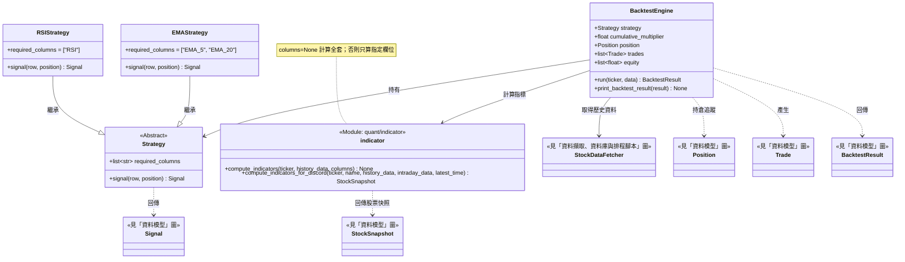
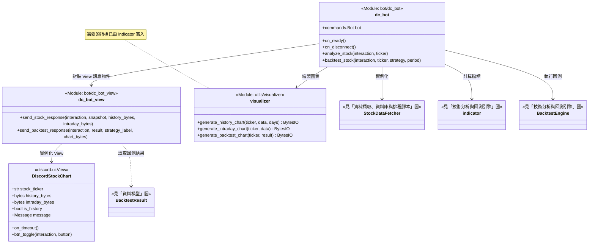
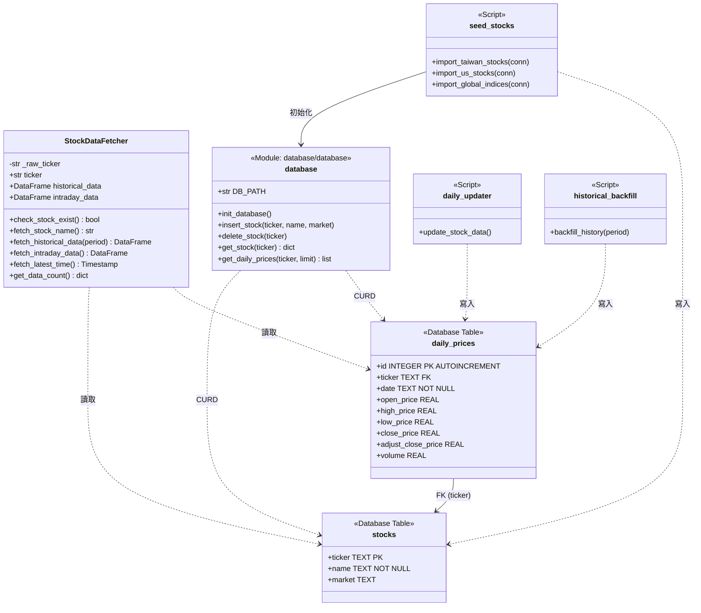

# 系統架構與 UML 類別圖

依專案目錄結構拆成 4 張圖，避免單一巨圖因跨層關聯過多、Mermaid 自動排版變得雜亂難讀。若某類別的完整定義屬於其他圖，會以 `<<見「X」圖>>` 標註，只保留關聯線。

## 1. 資料模型 (Models)

`src/models/` 下的共用資料傳輸物件，被 Quant 與 Bot 層共用。

## 2. 技術分析與回測引擎 (Quant)

`src/quant/` 策略介面與回測引擎；`Strategy` 子類別透過 `required_columns` 告知引擎所需指標。

## 3. Discord 機器人與圖表渲染 (Bot & Utils)

`src/bot/` 斜線指令與 View 元件；`src/utils/visualizer.py` 負責產生圖表 bytes。

## 4. 資料擷取、資料庫與排程腳本 (Data & Database & Scripts)

`src/data/fetcher.py` 整合 SQLite 與 yfinance；`src/database/` 為底層 CRUD；`scripts/` 為獨立排程腳本。

